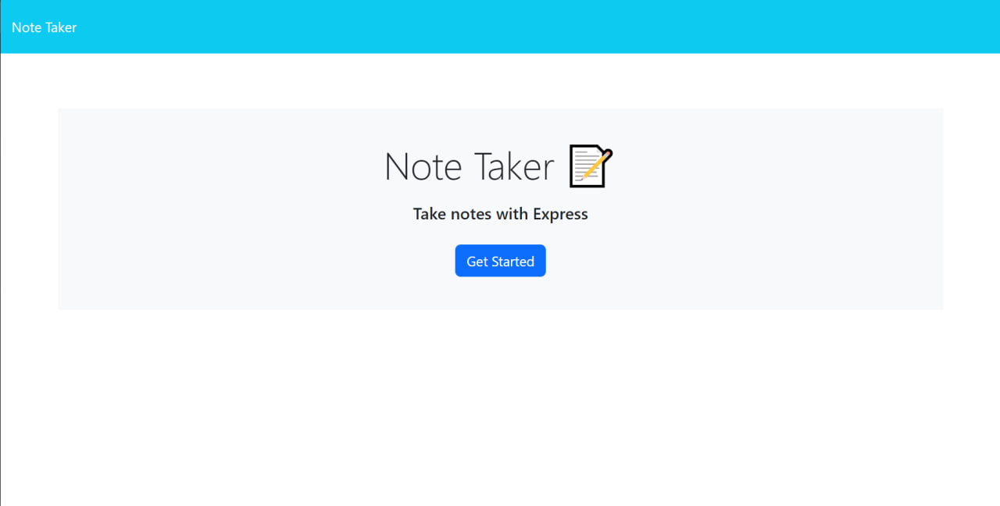
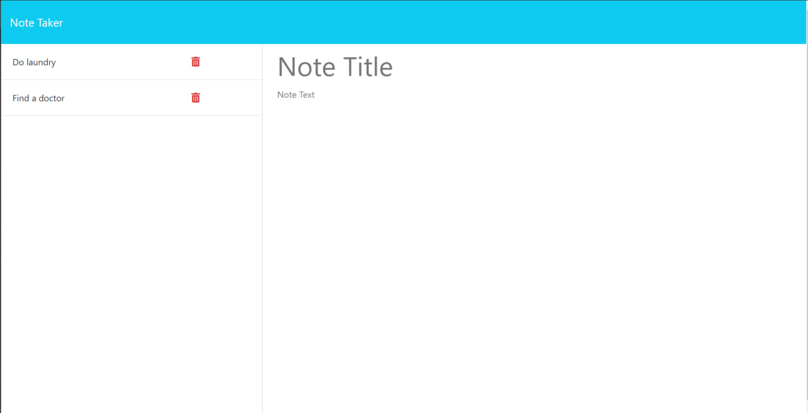
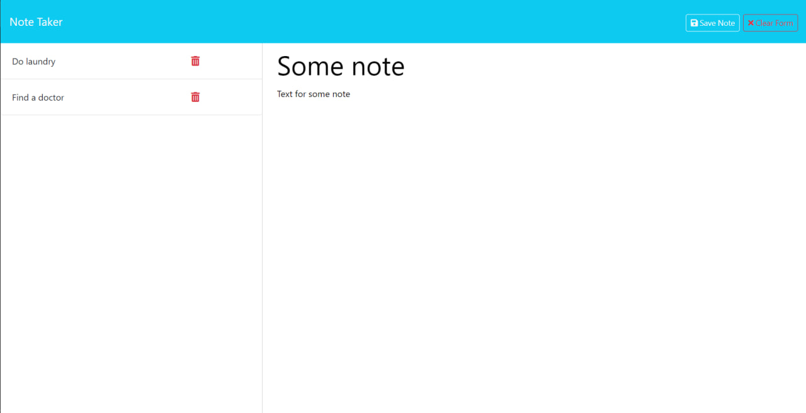
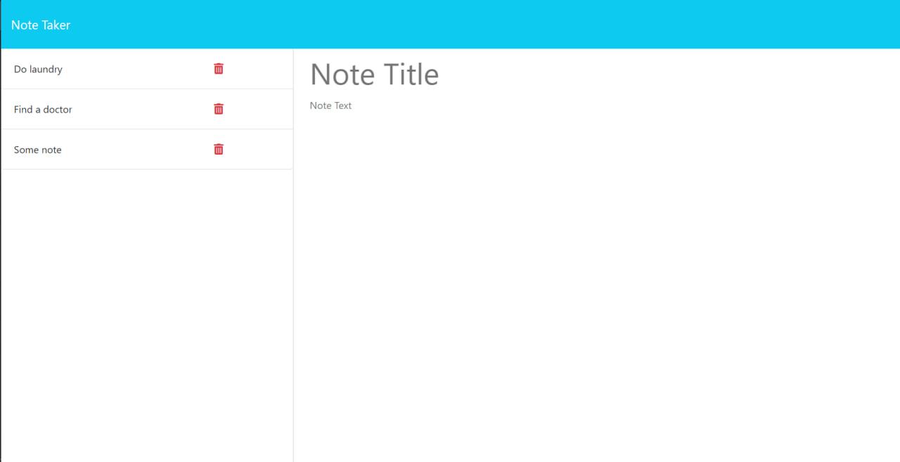

# Note Taker Starter Code
App to save your notes and remove it when done
## Description

In this project I wanted to modify front end code to add back end functionality. I wanted to add switch screen functionality to main screen button, to transfer user to <mark style="background-color: lightblue">/notes</mark> screen. In the <mark style="background-color: lightblue">/notes</mark> screen I wanted to add functionality to save button to process user input and save it in <mark style="background-color: lightblue">db.json</mark>. And return this data to left side bar. Also I wanted to add functionality to left side badr when user click on existing saved note it opens on right side. In the end I wanted to add functionality to delite button on left side. When user click on it, it delite data from <mark style="background-color: lightblue">db.json</mark> and delite if from screen as well.

## Table of Contets

- [Screenshots](#screenshots)
- [Links](#links)

## Screenshots

In this section I provided screenshots of the  Application.

## Links

In this section I added links to the deployed application and to the GitHub repositories with the original codebase and modified code.

The URL of the deployed application:
    https://my-note-reminder.onrender.com

Modified Project Repository:
    https://github.com/MykhailoZakh/My-Note-Reminder

Original Code Repository:
    https://github.com/coding-boot-camp/miniature-eureka